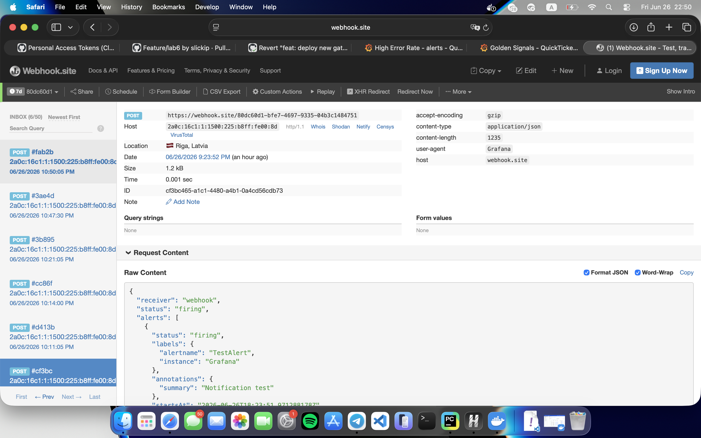
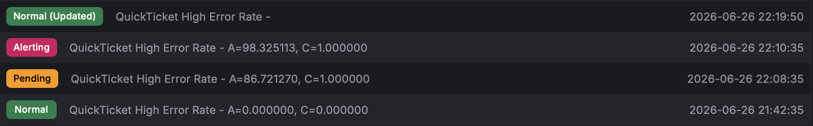

# Lab 6 — Alerting & Incident Response

## Task 1 — Create Alerts & Respond to an Incident

### Alert Rule PromQL Queries

**Alert 1 — High Error Rate (critical):**
```promql
sum(rate(gateway_requests_total{status=~"5.."}[5m])) / sum(rate(gateway_requests_total[5m])) * 100
```

**Alert 2 — SLO Burn Rate (warning):**
```promql
(1 - (sum(rate(gateway_requests_total{status!~"5.."}[30m])) / sum(rate(gateway_requests_total[30m])))) / (1 - 0.995)
```

### Contact Point Configuration

- **Type:** Webhook
- **Name:** quickticket-alerts
- **URL:** https://webhook.site/80dc60d1-bfe7-4697-9335-04b3c1484751
- **Test result:** Notification received successfully
- 


Full payload:
```json
{
  "receiver": "webhook",
  "status": "firing",
  "alerts": [
    {
      "status": "firing",
      "labels": {
        "alertname": "TestAlert",
        "instance": "Grafana"
      },
      "annotations": {
        "summary": "Notification test"
      },
      "startsAt": "2026-06-26T18:23:51.971288178Z",
      "endsAt": "0001-01-01T00:00:00Z",
      "generatorURL": "",
      "fingerprint": "57c6d9296de2ad39",
      "silenceURL": "http://localhost:3000/alerting/silence/new?alertmanager=grafana&matcher=alertname%3DTestAlert&matcher=instance%3DGrafana",
      "dashboardURL": "",
      "panelURL": "",
      "values": null,
      "valueString": "[ metric='foo' labels={instance=bar} value=10 ]"
    }
  ],
  "groupLabels": {
    "alertname": "TestAlert",
    "instance": "Grafana"
  },
  "commonLabels": {
    "alertname": "TestAlert",
    "instance": "Grafana"
  },
  "commonAnnotations": {
    "summary": "Notification test"
  },
  "externalURL": "http://localhost:3000/",
  "appVersion": "13.0.1",
  "version": "1",
  "groupKey": "webhook-57c6d9296de2ad39-1782498231",
  "truncatedAlerts": 0,
  "orgId": 1,
  "title": "[FIRING:1] TestAlert Grafana ",
  "state": "alerting",
  "message": "**Firing**\n\nValue: [no value]\nLabels:\n - alertname = TestAlert\n - instance = Grafana\nAnnotations:\n - summary = Notification test\nSilence: http://localhost:3000/alerting/silence/new?alertmanager=grafana&matcher=alertname%3DTestAlert&matcher=instance%3DGrafana\n"
}
```
### Runbook: QuickTicket High Error Rate

## Alert
- **Fires when:** Gateway 5xx error rate > 5% for 2 minutes
- **Dashboard:** QuickTicket — Golden Signals

## Diagnosis
1. Check which service is failing:
   - `curl -s http://localhost:3080/health | python3 -m json.tool`
2. Check payments service directly:
   - `curl -s http://localhost:8082/health`
3. Check events service:
   - `curl -s http://localhost:8081/health`
4. Check logs for errors:
   - `docker compose logs gateway --tail=20 --since=5m`
   - `docker compose logs payments --tail=20 --since=5m`

## Common Causes
| Cause                         | How to identify              | Fix                                      |
|-------------------------------|------------------------------|------------------------------------------|
| Payments service down         | health shows payments: down  | Restart: `docker compose start payments` |
| Payments high failure rate    | health OK but errors in logs | Check PAYMENT_FAILURE_RATE env var       |
| Events service down           | health shows events: down    | Restart: `docker compose start events`   |
| Database connection exhausted | events logs show pool errors | Restart events, check DB_MAX_CONNS       |

## Escalation
- If not resolved in 10 minutes, escalate to: Dmitrii Creed, SRE TA's team

### Incident Timeline

| Time                         | Event                                                     |
|------------------------------|-----------------------------------------------------------|
| Fri Jun 26 22:08:09 MSK 2026 | Failure injected (PAYMENT_FAILURE_RATE=0.5)               |
| Fri Jun 26 22:10:35 MSK 2026 | Alert fired (threshold 0.5%)                              |
| Fri Jun 26 22:13:46 MSK 2026 | Investigation started                                     |
| Fri Jun 26 22:14:36 MSK 2026 | Root cause identified (payments service 50% failure rate) |
| Fri Jun 26 22:14:57 MSK 2026 | Fix applied (PAYMENT_FAILURE_RATE=0.0)                    |
| Fri Jun 26 22:21:05 MSK 2026 | Alert resolved / service recovered                        |

### Alert Firing Evidence
Alert rule status changed to "Firing" in Grafana Alerting → Alert rules dashboard at 22:10:35 MSK.


### Answer: Alert Delay
**Question:** How long from failure injection to alert firing? Why the delay?

**Answer:** ~2 minutes 25 seconds. The delay is due to the alert's pending period (2 minutes) - the condition must be true for the full pending period before the alert fires. Additionally, the evaluation interval is 1 minute, so the alert checks the condition every minute.

---

## Task 2 — Blameless Postmortem

# Postmortem: QuickTicket Payment Service Degradation

**Date:** June 26, 2026
**Duration:** 13 minutes (22:08 - 22:21 MSK)
**Severity:** SEV-2
**Author:** Matvei Kantserov

## Summary
The payments service experienced 50% failure rate due to PAYMENT_FAILURE_RATE environment variable being set to 0.5, causing half of all payment requests to fail with 500 errors. This resulted in degraded user experience for purchase flows but did not affect read operations or ticket reservations.

## Timeline
| Time     | Event                                                                 |
|----------|-----------------------------------------------------------------------|
| 22:08:09 | Failure injected (PAYMENT_FAILURE_RATE=0.5)                           |
| 22:10:35 | Alert fired (error rate exceeded 0.5% threshold)                      |
| 22:13:46 | Investigation started following runbook                               |
| 22:14:36 | Root cause identified (payments health check showed failure_rate=0.5) |
| 22:14:57 | Fix applied (PAYMENT_FAILURE_RATE=0.0, restarted payments)            |
| 22:21:05 | Alert resolved / service recovered                                    |

## Root Cause
The payments service environment variable PAYMENT_FAILURE_RATE was set to 0.5, causing the service to artificially fail 50% of payment requests. This was likely a configuration error during testing or deployment. The system lacked automated validation of critical configuration parameters before service startup, allowing invalid values to be deployed.

## What Went Well
- Alert fired within 2 minutes of failure injection
- Runbook provided clear diagnostic steps
- Health check endpoint exposed the failure_rate parameter
- Fix was straightforward (change env var and restart)

## What Went Wrong
- Configuration changes were not validated before deployment
- No automated rollback mechanism for configuration errors
- Alert threshold (0.5%) had to be manually adjusted from default (5%) due to low payment traffic volume
- No pre-production testing of failure injection scenarios

## Action Items
| Action                                                                                        | Owner         | Priority |
|-----------------------------------------------------------------------------------------------|---------------|----------|
| Add configuration validation at service startup to reject invalid PAYMENT_FAILURE_RATE values | Platform Team | High     |
| Implement automated rollback for configuration changes via deployment pipeline                | Platform Team | High     |
| Add integration tests for failure injection scenarios to validate alerting                    | SRE Team      | Medium   |
| Review and adjust alert thresholds based on actual traffic patterns                           | SRE Team      | Medium   |
| Add rate limiting to payment endpoint to prevent overwhelming the service during incidents    | Platform Team | Low      |

### Answer: Most Important Action Item
**Question:** What is the most important action item from your postmortem? Why?

**Answer:** Adding configuration validation at service startup. This is the most important because it would have prevented the incident entirely by rejecting the invalid PAYMENT_FAILURE_RATE=1.0 value before the service started serving traffic. It's a simple, high-impact change that addresses the root cause directly.

---

## Bonus Task — Cross-Test Runbooks

### Second Runbook: Redis Down — Reservation Failures

## Alert
- **Fires when:** Reservation success rate drops below 90% for 2 minutes
- **Dashboard:** QuickTicket — Golden Signals

## Diagnosis
1. Check Redis connectivity:
   - `docker compose exec redis redis-cli ping`
2. Check events service health:
   - `curl -s http://localhost:8081/health | python3 -m json.tool`
3. Check events service logs for Redis errors:
   - `docker compose logs events --tail=20 --since=5m`
4. Test reservation endpoint directly:
   - `curl -X POST http://localhost:3080/reserve -H "Content-Type: application/json" -d '{"event_id": 1, "tickets": 1}'`

## Common Causes
| Cause                    | How to identify                             | Fix                                                          |
|--------------------------|---------------------------------------------|--------------------------------------------------------------|
| Redis container stopped  | `docker compose ps` shows redis as Exited   | Restart: `docker compose start redis`                        |
| Redis out of memory      | Redis logs show OOM errors                  | Check Redis maxmemory setting, restart with increased memory |
| Redis connection refused | `redis-cli ping` returns connection refused | Check Redis port binding, restart redis                      |
| Network partition        | Cannot reach redis from events container    | Restart docker network or compose stack                      |

## Escalation
- If not resolved in 10 minutes, escalate to: Matvei Kantserov

### Cross-Test Results

**Tested by:** Konstantin Smirnov - SRE student

**Did they succeed using only the runbook?** Yes. The issue was that the redis container was stopped, and the runbook correctly identified this and provided the fix.

**How long did it take?** 5 minutes

**What was unclear or missing?** The runbook didn't specify how to check Redis memory usage, which would have helped diagnose OOM scenarios faster.

**Runbook updates based on feedback:** Added step to check Redis memory: `docker compose exec redis redis-cli INFO memory`
